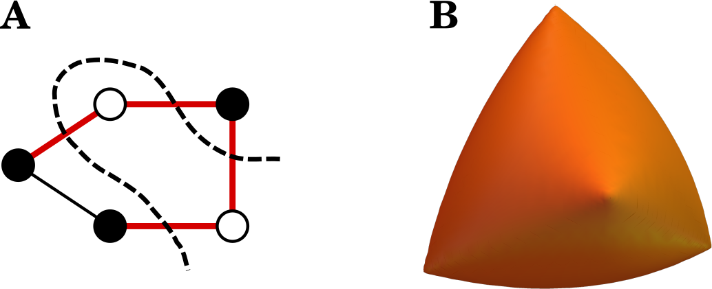

# Max-Cut and Goemans-Williamson

## Introduction

This repository contains a simple implementation `maxcut.py` in Python using CVXPY <ins>[[1]](https://www.cvxpy.org/)</ins> of Goemans-Williamson algorithm <ins>[[2]](http://www-math.mit.edu/~goemans/PAPERS/maxcut-jacm.pdf)</ins> for Max-Cut problem of finding a maximum cut of a graph

You can read more about it in the summary or check the presentation slides for a quick overview.

## References
[1] Diamond and Boyd. "CVXPY: A Python-embedded modeling language for convex optimization", version 1.2. [https://www.cvxpy.org/](https://www.cvxpy.org/)

[2] Goemans and Williamson. "Improved approximation algorithms for maximum cut and
  satisfiability problems using semidefinite programming". J. ACM, 42(6):1115–1145, 1995.
  [http://www-math.mit.edu/~goemans/PAPERS/maxcut-jacm.pdf](http://www-math.mit.edu/~goemans/PAPERS/maxcut-jacm.pdf)